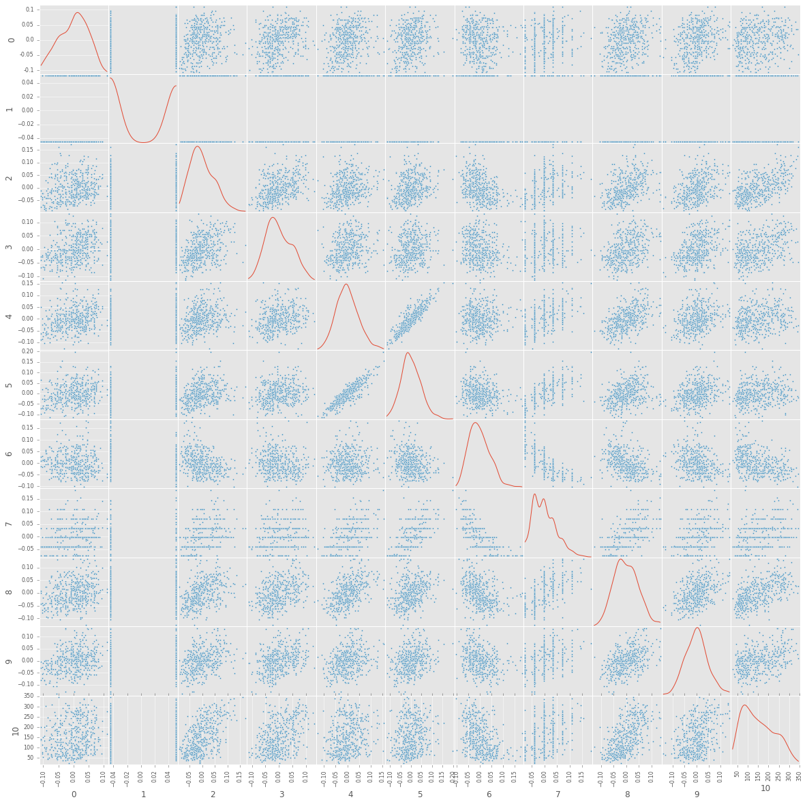
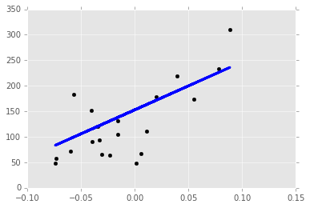
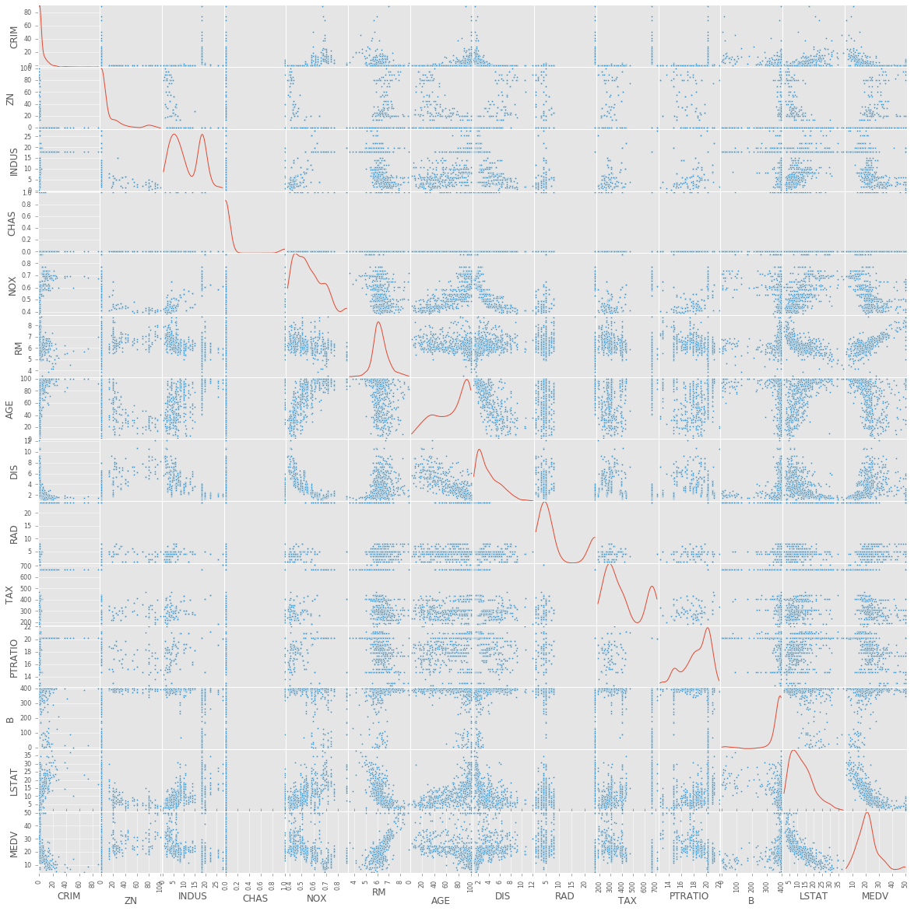

# 03. Regression


```python
import numpy as np
import matplotlib.pyplot as plt
from sklearn import datasets, linear_model, cross_validation
import pandas as pd

%matplotlib inline
plt.style.use("ggplot")
```

### Diabetes data
Scikit Learn 내장 데이터  
http://scikit-learn.org/stable/auto_examples/linear_model/plot_ols.html  
참고 : http://scikit-learn.org/stable/modules/linear_model.html


```python
# Load the diabetes dataset
diabetes = datasets.load_diabetes()
```


```python
diabetes_df = pd.DataFrame(np.append(diabetes.data, diabetes.target[:, np.newaxis], 1))
diabetes_df.head()
```


<div>
<table border="1" class="dataframe">
  <thead>
    <tr style="text-align: right;">
      <th></th>
      <th>0</th>
      <th>1</th>
      <th>2</th>
      <th>3</th>
      <th>4</th>
      <th>5</th>
      <th>6</th>
      <th>7</th>
      <th>8</th>
      <th>9</th>
      <th>10</th>
    </tr>
  </thead>
  <tbody>
    <tr>
      <th>0</th>
      <td>0.038076</td>
      <td>0.050680</td>
      <td>0.061696</td>
      <td>0.021872</td>
      <td>-0.044223</td>
      <td>-0.034821</td>
      <td>-0.043401</td>
      <td>-0.002592</td>
      <td>0.019908</td>
      <td>-0.017646</td>
      <td>151.0</td>
    </tr>
    <tr>
      <th>1</th>
      <td>-0.001882</td>
      <td>-0.044642</td>
      <td>-0.051474</td>
      <td>-0.026328</td>
      <td>-0.008449</td>
      <td>-0.019163</td>
      <td>0.074412</td>
      <td>-0.039493</td>
      <td>-0.068330</td>
      <td>-0.092204</td>
      <td>75.0</td>
    </tr>
    <tr>
      <th>2</th>
      <td>0.085299</td>
      <td>0.050680</td>
      <td>0.044451</td>
      <td>-0.005671</td>
      <td>-0.045599</td>
      <td>-0.034194</td>
      <td>-0.032356</td>
      <td>-0.002592</td>
      <td>0.002864</td>
      <td>-0.025930</td>
      <td>141.0</td>
    </tr>
    <tr>
      <th>3</th>
      <td>-0.089063</td>
      <td>-0.044642</td>
      <td>-0.011595</td>
      <td>-0.036656</td>
      <td>0.012191</td>
      <td>0.024991</td>
      <td>-0.036038</td>
      <td>0.034309</td>
      <td>0.022692</td>
      <td>-0.009362</td>
      <td>206.0</td>
    </tr>
    <tr>
      <th>4</th>
      <td>0.005383</td>
      <td>-0.044642</td>
      <td>-0.036385</td>
      <td>0.021872</td>
      <td>0.003935</td>
      <td>0.015596</td>
      <td>0.008142</td>
      <td>-0.002592</td>
      <td>-0.031991</td>
      <td>-0.046641</td>
      <td>135.0</td>
    </tr>
  </tbody>
</table>
</div>


```python
pd.tools.plotting.scatter_matrix(diabetes_df, alpha=1, figsize=(20, 20), diagonal='kde')
```


    array([[<matplotlib.axes._subplots.AxesSubplot object at 0x128de3940>,
            <matplotlib.axes._subplots.AxesSubplot object at 0x12a100d68>,
            <matplotlib.axes._subplots.AxesSubplot object at 0x128f33320>,
            <matplotlib.axes._subplots.AxesSubplot object at 0x12a157ef0>,
            <matplotlib.axes._subplots.AxesSubplot object at 0x12a19fba8>,
            <matplotlib.axes._subplots.AxesSubplot object at 0x12a1c6908>,
            <matplotlib.axes._subplots.AxesSubplot object at 0x12a202cc0>,
            <matplotlib.axes._subplots.AxesSubplot object at 0x12a23dfd0>,
            <matplotlib.axes._subplots.AxesSubplot object at 0x12a276da0>,
            <matplotlib.axes._subplots.AxesSubplot object at 0x12a2baeb8>,
            <matplotlib.axes._subplots.AxesSubplot object at 0x12a2f4da0>],
           [<matplotlib.axes._subplots.AxesSubplot object at 0x12a33d898>,
            <matplotlib.axes._subplots.AxesSubplot object at 0x12a378240>,
            <matplotlib.axes._subplots.AxesSubplot object at 0x12a3c2a90>,
            <matplotlib.axes._subplots.AxesSubplot object at 0x12a38d6d8>,
            <matplotlib.axes._subplots.AxesSubplot object at 0x12a449908>,
            <matplotlib.axes._subplots.AxesSubplot object at 0x12a493b00>,
            <matplotlib.axes._subplots.AxesSubplot object at 0x12a4d2dd8>,
            <matplotlib.axes._subplots.AxesSubplot object at 0x12a5227f0>,
            <matplotlib.axes._subplots.AxesSubplot object at 0x12a55d160>,
            <matplotlib.axes._subplots.AxesSubplot object at 0x12a5a6080>,
            <matplotlib.axes._subplots.AxesSubplot object at 0x12a5e7160>],
           [<matplotlib.axes._subplots.AxesSubplot object at 0x12a62fc18>,
            <matplotlib.axes._subplots.AxesSubplot object at 0x12a64fb38>,
            <matplotlib.axes._subplots.AxesSubplot object at 0x12a6bc470>,
            <matplotlib.axes._subplots.AxesSubplot object at 0x12a70acc0>,
            <matplotlib.axes._subplots.AxesSubplot object at 0x12a745668>,
            <matplotlib.axes._subplots.AxesSubplot object at 0x12a790978>,
            <matplotlib.axes._subplots.AxesSubplot object at 0x12a7cfe10>,
            <matplotlib.axes._subplots.AxesSubplot object at 0x12a81f518>,
            <matplotlib.axes._subplots.AxesSubplot object at 0x12a855e10>,
            <matplotlib.axes._subplots.AxesSubplot object at 0x12a8a8160>,
            <matplotlib.axes._subplots.AxesSubplot object at 0x12a8f69b0>],
           [<matplotlib.axes._subplots.AxesSubplot object at 0x12a931908>,
            <matplotlib.axes._subplots.AxesSubplot object at 0x12a97ba20>,
            <matplotlib.axes._subplots.AxesSubplot object at 0x12a9bc438>,
            <matplotlib.axes._subplots.AxesSubplot object at 0x12aa03ef0>,
            <matplotlib.axes._subplots.AxesSubplot object at 0x12aa41898>,
            <matplotlib.axes._subplots.AxesSubplot object at 0x12aa90588>,
            <matplotlib.axes._subplots.AxesSubplot object at 0x12aa5e630>,
            <matplotlib.axes._subplots.AxesSubplot object at 0x12ab192b0>,
            <matplotlib.axes._subplots.AxesSubplot object at 0x12ab633c8>,
            <matplotlib.axes._subplots.AxesSubplot object at 0x12aba2390>,
            <matplotlib.axes._subplots.AxesSubplot object at 0x12abebd68>],
           [<matplotlib.axes._subplots.AxesSubplot object at 0x12ac286d8>,
            <matplotlib.axes._subplots.AxesSubplot object at 0x12ac76f28>,
            <matplotlib.axes._subplots.AxesSubplot object at 0x12acb46d8>,
            <matplotlib.axes._subplots.AxesSubplot object at 0x12acfc9e8>,
            <matplotlib.axes._subplots.AxesSubplot object at 0x12ad0cd30>,
            <matplotlib.axes._subplots.AxesSubplot object at 0x12ad8b0b8>,
            <matplotlib.axes._subplots.AxesSubplot object at 0x12add44e0>,
            <matplotlib.axes._subplots.AxesSubplot object at 0x12ae0f7f0>,
            <matplotlib.axes._subplots.AxesSubplot object at 0x12ae59710>,
            <matplotlib.axes._subplots.AxesSubplot object at 0x12ae97f98>,
            <matplotlib.axes._subplots.AxesSubplot object at 0x12aee86a0>],
           [<matplotlib.axes._subplots.AxesSubplot object at 0x12af1ff98>,
            <matplotlib.axes._subplots.AxesSubplot object at 0x12af722e8>,
            <matplotlib.axes._subplots.AxesSubplot object at 0x12afc0b38>,
            <matplotlib.axes._subplots.AxesSubplot object at 0x12affba90>,
            <matplotlib.axes._subplots.AxesSubplot object at 0x12b045ba8>,
            <matplotlib.axes._subplots.AxesSubplot object at 0x12b0865c0>,
            <matplotlib.axes._subplots.AxesSubplot object at 0x12b0d60b8>,
            <matplotlib.axes._subplots.AxesSubplot object at 0x12b10aa20>,
            <matplotlib.axes._subplots.AxesSubplot object at 0x12b159710>,
            <matplotlib.axes._subplots.AxesSubplot object at 0x12b127828>,
            <matplotlib.axes._subplots.AxesSubplot object at 0x12b1e2438>],
           [<matplotlib.axes._subplots.AxesSubplot object at 0x12b22d550>,
            <matplotlib.axes._subplots.AxesSubplot object at 0x12b26d518>,
            <matplotlib.axes._subplots.AxesSubplot object at 0x12b2b6ef0>,
            <matplotlib.axes._subplots.AxesSubplot object at 0x12b2f3860>,
            <matplotlib.axes._subplots.AxesSubplot object at 0x12b3460f0>,
            <matplotlib.axes._subplots.AxesSubplot object at 0x12b37b860>,
            <matplotlib.axes._subplots.AxesSubplot object at 0x12b3c5b70>,
            <matplotlib.axes._subplots.AxesSubplot object at 0x12b3d62b0>,
            <matplotlib.axes._subplots.AxesSubplot object at 0x12b454240>,
            <matplotlib.axes._subplots.AxesSubplot object at 0x12b49e668>,
            <matplotlib.axes._subplots.AxesSubplot object at 0x12b4d8978>],
           [<matplotlib.axes._subplots.AxesSubplot object at 0x12b524898>,
            <matplotlib.axes._subplots.AxesSubplot object at 0x12b56a160>,
            <matplotlib.axes._subplots.AxesSubplot object at 0x12b5b2828>,
            <matplotlib.axes._subplots.AxesSubplot object at 0x12b5f4160>,
            <matplotlib.axes._subplots.AxesSubplot object at 0x12b63e470>,
            <matplotlib.axes._subplots.AxesSubplot object at 0x12b68bcc0>,
            <matplotlib.axes._subplots.AxesSubplot object at 0x12b6c7c18>,
            <matplotlib.axes._subplots.AxesSubplot object at 0x12b711d30>,
            <matplotlib.axes._subplots.AxesSubplot object at 0x12b750748>,
            <matplotlib.axes._subplots.AxesSubplot object at 0x12b7a1240>,
            <matplotlib.axes._subplots.AxesSubplot object at 0x12b7d7ba8>],
           [<matplotlib.axes._subplots.AxesSubplot object at 0x12b824898>,
            <matplotlib.axes._subplots.AxesSubplot object at 0x12b7f49b0>,
            <matplotlib.axes._subplots.AxesSubplot object at 0x12b8af5c0>,
            <matplotlib.axes._subplots.AxesSubplot object at 0x12b8f86d8>,
            <matplotlib.axes._subplots.AxesSubplot object at 0x12b9396a0>,
            <matplotlib.axes._subplots.AxesSubplot object at 0x12b98a0b8>,
            <matplotlib.axes._subplots.AxesSubplot object at 0x12b9bd9e8>,
            <matplotlib.axes._subplots.AxesSubplot object at 0x12ba11278>,
            <matplotlib.axes._subplots.AxesSubplot object at 0x12ba489e8>,
            <matplotlib.axes._subplots.AxesSubplot object at 0x12bac1cf8>,
            <matplotlib.axes._subplots.AxesSubplot object at 0x12bad11d0>],
           [<matplotlib.axes._subplots.AxesSubplot object at 0x12bb503c8>,
            <matplotlib.axes._subplots.AxesSubplot object at 0x12bb9b7f0>,
            <matplotlib.axes._subplots.AxesSubplot object at 0x12bbd5b00>,
            <matplotlib.axes._subplots.AxesSubplot object at 0x12bc20a20>,
            <matplotlib.axes._subplots.AxesSubplot object at 0x12bc642e8>,
            <matplotlib.axes._subplots.AxesSubplot object at 0x12bcb09b0>,
            <matplotlib.axes._subplots.AxesSubplot object at 0x12bcf02e8>,
            <matplotlib.axes._subplots.AxesSubplot object at 0x12bd375f8>,
            <matplotlib.axes._subplots.AxesSubplot object at 0x12bd86e48>,
            <matplotlib.axes._subplots.AxesSubplot object at 0x12bdc0da0>,
            <matplotlib.axes._subplots.AxesSubplot object at 0x12be0beb8>],
           [<matplotlib.axes._subplots.AxesSubplot object at 0x12be4c8d0>,
            <matplotlib.axes._subplots.AxesSubplot object at 0x12be9a3c8>,
            <matplotlib.axes._subplots.AxesSubplot object at 0x12bed1d30>,
            <matplotlib.axes._subplots.AxesSubplot object at 0x12bf20a20>,
            <matplotlib.axes._subplots.AxesSubplot object at 0x12beedba8>,
            <matplotlib.axes._subplots.AxesSubplot object at 0x12bfa9748>,
            <matplotlib.axes._subplots.AxesSubplot object at 0x12bff2860>,
            <matplotlib.axes._subplots.AxesSubplot object at 0x12c032828>,
            <matplotlib.axes._subplots.AxesSubplot object at 0x12c083240>,
            <matplotlib.axes._subplots.AxesSubplot object at 0x12c0b8b70>,
            <matplotlib.axes._subplots.AxesSubplot object at 0x12c10c400>]], dtype=object)





```python
# Use only one feature
diabetes_X = diabetes.data[:, np.newaxis, 2]
```


```python
# np.newaxis
diabetes_X.shape, diabetes.data[:, 2].shape
```


    ((442, 1), (442,))


```python
# Split the data into training/testing sets
diabetes_X_train = diabetes_X[:-20]
diabetes_X_test = diabetes_X[-20:]

# Split the targets into training/testing sets
diabetes_y_train = diabetes.target[:-20]
diabetes_y_test = diabetes.target[-20:]
```


```python
diabetes_X_train.shape, diabetes_X_test.shape
```


    ((422, 1), (20, 1))


```python
# Create linear regression object
regr = linear_model.LinearRegression()
```


```python
# Train the model using the training sets
regr.fit(diabetes_X_train, diabetes_y_train)
```

    /usr/local/lib/python3.5/site-packages/scipy/linalg/basic.py:884: RuntimeWarning: internal gelsd driver lwork query error, required iwork dimension not returned. This is likely the result of LAPACK bug 0038, fixed in LAPACK 3.2.2 (released July 21, 2010). Falling back to 'gelss' driver.
      warnings.warn(mesg, RuntimeWarning)


    LinearRegression(copy_X=True, fit_intercept=True, n_jobs=1, normalize=False)


```python
# The coefficients and the intercept
print('Intercept\t Coefficients \n', regr.intercept_, "\t", regr.coef_)
# The mean square error
print("\n")
print("Residual sum of squares: %.2f"
      % np.mean((regr.predict(diabetes_X_test) - diabetes_y_test) ** 2))
# Explained variance score: 1 is perfect prediction
print('Variance score: %.2f' % regr.score(diabetes_X_test, diabetes_y_test))
```

    Intercept	 Coefficients 
     152.918861826 	 [ 938.23786125]
    
    
    Residual sum of squares: 2548.07
    Variance score: 0.47


##### Plot outputs


```python
plt.scatter(diabetes_X_test, diabetes_y_test,  color='black')
plt.plot(diabetes_X_test, regr.predict(diabetes_X_test), color='blue',
         linewidth=3)

# plt.xticks(())
# plt.yticks(())

plt.show()
```





##### Train/Test split


```python
X_train, X_test, y_train, y_test = cross_validation.train_test_split(diabetes.data, diabetes.target, test_size=0.05)
```


```python
X_train.shape, X_test.shape
```


    ((419, 10), (23, 10))


##### K-fold Cross Validation


```python
kf = cross_validation.KFold(30, n_folds=5, shuffle=True)
```


```python
for train_index, test_index in kf:
    print("TRAIN:", train_index, "TEST:", test_index)
#     X_train, X_test = X[train_index], X[test_index]
#     y_train, y_test = y[train_index], y[test_index]
```

    TRAIN: [ 0  1  2  3  4  5  6  8  9 11 13 14 16 17 19 20 21 23 24 25 26 27 28 29] TEST: [ 7 10 12 15 18 22]
    TRAIN: [ 0  1  2  3  4  5  7  8  9 10 12 13 14 15 16 17 18 19 21 22 23 24 26 29] TEST: [ 6 11 20 25 27 28]
    TRAIN: [ 0  1  4  5  6  7  8  9 10 11 12 13 14 15 16 17 18 20 22 24 25 27 28 29] TEST: [ 2  3 19 21 23 26]
    TRAIN: [ 1  2  3  6  7 10 11 12 13 15 16 17 18 19 20 21 22 23 24 25 26 27 28 29] TEST: [ 0  4  5  8  9 14]
    TRAIN: [ 0  2  3  4  5  6  7  8  9 10 11 12 14 15 18 19 20 21 22 23 25 26 27 28] TEST: [ 1 13 16 17 24 29]


```python
kf = cross_validation.KFold(diabetes.data.shape[0], n_folds=5, shuffle=True)
for train_index, test_index in kf:
    print("TRAIN:", train_index, "TEST:", test_index)
#     X_train, X_test = X[train_index], X[test_index]
#     y_train, y_test = y[train_index], y[test_index]
```

    TRAIN: [  0   1   2   3   5   6   7   8   9  10  11  12  13  14  15  16  19  22
      24  25  27  28  30  31  32  33  34  35  36  39  43  44  45  46  47  48
      49  50  51  53  54  55  56  58  59  60  61  62  63  64  65  66  67  68
      69  70  71  72  73  74  75  76  77  78  79  80  82  83  84  85  86  89
      90  91  92  93  94  95  96  97  98 100 101 102 103 104 105 107 108 109
     110 111 112 113 114 115 116 118 121 122 123 124 126 128 129 130 133 134
     135 136 138 139 140 141 142 143 144 146 147 148 149 150 151 152 154 155
     156 157 160 161 162 163 164 166 167 168 169 170 171 174 175 177 178 179
     180 182 183 184 185 186 187 188 189 190 192 193 194 195 196 197 198 199
     200 201 202 203 204 206 208 209 210 211 212 213 214 215 216 217 218 219
     220 221 223 224 225 226 230 231 232 233 234 235 236 237 238 239 240 242
     243 244 245 246 247 248 249 250 252 253 254 255 256 257 258 259 260 262
     263 265 266 267 270 271 273 274 275 278 279 280 282 283 284 287 288 291
     292 293 294 295 296 297 298 300 301 302 303 304 306 307 308 312 313 314
     315 316 317 320 321 323 324 325 326 327 328 329 330 331 332 333 335 337
     339 340 342 343 344 345 347 348 349 350 351 352 353 354 355 356 357 359
     360 361 362 364 365 366 367 368 369 370 371 374 377 378 379 380 381 384
     386 387 388 389 390 392 394 395 396 397 398 400 401 402 403 404 405 406
     408 409 410 411 413 414 415 417 418 419 420 421 423 424 425 426 427 428
     429 430 431 432 433 435 436 437 438 440 441] TEST: [  4  17  18  20  21  23  26  29  37  38  40  41  42  52  57  81  87  88
      99 106 117 119 120 125 127 131 132 137 145 153 158 159 165 172 173 176
     181 191 205 207 222 227 228 229 241 251 261 264 268 269 272 276 277 281
     285 286 289 290 299 305 309 310 311 318 319 322 334 336 338 341 346 358
     363 372 373 375 376 382 383 385 391 393 399 407 412 416 422 434 439]
    TRAIN: [  0   1   2   3   4   5   6   7   9  10  11  13  15  17  18  20  21  22
      23  24  26  28  29  30  31  32  33  34  35  36  37  38  40  41  42  43
      44  46  47  48  49  50  51  52  53  54  55  57  58  59  60  61  62  64
      65  66  67  68  69  70  73  75  76  77  79  81  82  85  86  87  88  89
      90  91  93  94  95  96  97  99 100 101 102 103 104 105 106 107 108 109
     112 113 114 115 116 117 118 119 120 121 122 123 124 125 127 129 130 131
     132 133 134 135 136 137 139 140 141 142 143 144 145 146 147 148 150 151
     152 153 154 155 156 157 158 159 162 164 165 166 167 168 170 171 172 173
     174 175 176 177 179 180 181 182 183 184 185 186 187 188 190 191 192 193
     195 197 199 200 202 204 205 206 207 209 210 211 212 214 215 217 218 220
     221 222 223 224 226 227 228 229 231 232 233 234 235 236 239 240 241 243
     244 245 246 248 249 250 251 252 255 256 258 259 260 261 262 264 265 267
     268 269 270 272 273 275 276 277 278 280 281 282 283 284 285 286 289 290
     292 294 295 296 297 299 300 301 302 303 304 305 306 307 309 310 311 312
     313 315 316 317 318 319 322 325 327 331 332 333 334 335 336 337 338 339
     340 341 342 344 345 346 348 351 352 354 355 356 357 358 359 360 361 362
     363 364 365 366 367 368 369 370 371 372 373 375 376 377 378 380 382 383
     384 385 386 387 389 391 392 393 394 395 397 398 399 400 401 402 403 404
     405 406 407 408 410 412 413 416 418 419 421 422 423 424 425 426 427 428
     429 430 432 433 434 435 437 438 439 440 441] TEST: [  8  12  14  16  19  25  27  39  45  56  63  71  72  74  78  80  83  84
      92  98 110 111 126 128 138 149 160 161 163 169 178 189 194 196 198 201
     203 208 213 216 219 225 230 237 238 242 247 253 254 257 263 266 271 274
     279 287 288 291 293 298 308 314 320 321 323 324 326 328 329 330 343 347
     349 350 353 374 379 381 388 390 396 409 411 414 415 417 420 431 436]
    TRAIN: [  0   1   2   3   4   6   7   8   9  10  12  13  14  15  16  17  18  19
      20  21  22  23  25  26  27  28  29  30  31  32  34  35  37  38  39  40
      41  42  43  44  45  47  49  50  52  53  54  56  57  58  59  61  63  64
      65  67  68  70  71  72  74  76  77  78  79  80  81  82  83  84  85  86
      87  88  89  90  91  92  93  94  96  97  98  99 100 101 102 104 105 106
     108 109 110 111 112 114 115 116 117 118 119 120 122 123 124 125 126 127
     128 129 130 131 132 133 134 135 137 138 139 140 142 145 146 147 148 149
     152 153 154 155 156 158 159 160 161 163 165 166 168 169 170 171 172 173
     174 175 176 178 179 181 182 183 184 188 189 191 192 193 194 196 198 199
     200 201 203 204 205 206 207 208 209 211 212 213 215 216 218 219 220 221
     222 223 225 227 228 229 230 231 232 236 237 238 239 241 242 243 245 246
     247 248 249 251 252 253 254 255 256 257 258 260 261 262 263 264 266 267
     268 269 271 272 274 275 276 277 278 279 280 281 283 284 285 286 287 288
     289 290 291 292 293 298 299 300 301 302 303 304 305 306 307 308 309 310
     311 312 313 314 315 316 317 318 319 320 321 322 323 324 325 326 327 328
     329 330 331 332 333 334 336 337 338 339 341 343 345 346 347 348 349 350
     352 353 354 355 357 358 359 360 363 364 365 366 367 369 370 371 372 373
     374 375 376 379 380 381 382 383 384 385 386 387 388 389 390 391 392 393
     396 397 398 399 402 403 404 406 407 408 409 410 411 412 413 414 415 416
     417 419 420 422 424 429 431 434 435 436 439 441] TEST: [  5  11  24  33  36  46  48  51  55  60  62  66  69  73  75  95 103 107
     113 121 136 141 143 144 150 151 157 162 164 167 177 180 185 186 187 190
     195 197 202 210 214 217 224 226 233 234 235 240 244 250 259 265 270 273
     282 294 295 296 297 335 340 342 344 351 356 361 362 368 377 378 394 395
     400 401 405 418 421 423 425 426 427 428 430 432 433 437 438 440]
    TRAIN: [  0   2   3   4   5   7   8  10  11  12  14  16  17  18  19  20  21  22
      23  24  25  26  27  29  32  33  34  35  36  37  38  39  40  41  42  43
      45  46  47  48  51  52  53  55  56  57  60  62  63  64  65  66  67  68
      69  70  71  72  73  74  75  76  78  79  80  81  82  83  84  85  86  87
      88  90  91  92  93  95  97  98  99 100 102 103 104 106 107 108 109 110
     111 112 113 116 117 119 120 121 123 125 126 127 128 129 130 131 132 135
     136 137 138 140 141 143 144 145 146 149 150 151 152 153 155 156 157 158
     159 160 161 162 163 164 165 166 167 169 172 173 174 176 177 178 180 181
     182 183 185 186 187 189 190 191 192 194 195 196 197 198 199 201 202 203
     204 205 206 207 208 209 210 212 213 214 216 217 218 219 221 222 224 225
     226 227 228 229 230 231 232 233 234 235 237 238 239 240 241 242 244 247
     250 251 252 253 254 255 257 258 259 261 263 264 265 266 267 268 269 270
     271 272 273 274 276 277 279 281 282 283 285 286 287 288 289 290 291 292
     293 294 295 296 297 298 299 300 305 306 308 309 310 311 312 313 314 315
     316 317 318 319 320 321 322 323 324 325 326 327 328 329 330 333 334 335
     336 337 338 339 340 341 342 343 344 345 346 347 349 350 351 353 354 356
     357 358 359 361 362 363 367 368 369 372 373 374 375 376 377 378 379 381
     382 383 385 388 389 390 391 392 393 394 395 396 398 399 400 401 402 405
     407 409 411 412 413 414 415 416 417 418 420 421 422 423 425 426 427 428
     429 430 431 432 433 434 436 437 438 439 440 441] TEST: [  1   6   9  13  15  28  30  31  44  49  50  54  58  59  61  77  89  94
      96 101 105 114 115 118 122 124 133 134 139 142 147 148 154 168 170 171
     175 179 184 188 193 200 211 215 220 223 236 243 245 246 248 249 256 260
     262 275 278 280 284 301 302 303 304 307 331 332 348 352 355 360 364 365
     366 370 371 380 384 386 387 397 403 404 406 408 410 419 424 435]
    TRAIN: [  1   4   5   6   8   9  11  12  13  14  15  16  17  18  19  20  21  23
      24  25  26  27  28  29  30  31  33  36  37  38  39  40  41  42  44  45
      46  48  49  50  51  52  54  55  56  57  58  59  60  61  62  63  66  69
      71  72  73  74  75  77  78  80  81  83  84  87  88  89  92  94  95  96
      98  99 101 103 105 106 107 110 111 113 114 115 117 118 119 120 121 122
     124 125 126 127 128 131 132 133 134 136 137 138 139 141 142 143 144 145
     147 148 149 150 151 153 154 157 158 159 160 161 162 163 164 165 167 168
     169 170 171 172 173 175 176 177 178 179 180 181 184 185 186 187 188 189
     190 191 193 194 195 196 197 198 200 201 202 203 205 207 208 210 211 213
     214 215 216 217 219 220 222 223 224 225 226 227 228 229 230 233 234 235
     236 237 238 240 241 242 243 244 245 246 247 248 249 250 251 253 254 256
     257 259 260 261 262 263 264 265 266 268 269 270 271 272 273 274 275 276
     277 278 279 280 281 282 284 285 286 287 288 289 290 291 293 294 295 296
     297 298 299 301 302 303 304 305 307 308 309 310 311 314 318 319 320 321
     322 323 324 326 328 329 330 331 332 334 335 336 338 340 341 342 343 344
     346 347 348 349 350 351 352 353 355 356 358 360 361 362 363 364 365 366
     368 370 371 372 373 374 375 376 377 378 379 380 381 382 383 384 385 386
     387 388 390 391 393 394 395 396 397 399 400 401 403 404 405 406 407 408
     409 410 411 412 414 415 416 417 418 419 420 421 422 423 424 425 426 427
     428 430 431 432 433 434 435 436 437 438 439 440] TEST: [  0   2   3   7  10  22  32  34  35  43  47  53  64  65  67  68  70  76
      79  82  85  86  90  91  93  97 100 102 104 108 109 112 116 123 129 130
     135 140 146 152 155 156 166 174 182 183 192 199 204 206 209 212 218 221
     231 232 239 252 255 258 267 283 292 300 306 312 313 315 316 317 325 327
     333 337 339 345 354 357 359 367 369 389 392 398 402 413 429 441]


##### LOOCV


```python
loo = cross_validation.LeaveOneOut(10)
```


```python
for train_index, test_index in loo:
    print("TRAIN:", train_index, "TEST:", test_index)
#     X_train, X_test = X[train_index], X[test_index]
#     y_train, y_test = y[train_index], y[test_index]
#     print(X_train, X_test, y_train, y_test)
```

    TRAIN: [1 2 3 4 5 6 7 8 9] TEST: [0]
    TRAIN: [0 2 3 4 5 6 7 8 9] TEST: [1]
    TRAIN: [0 1 3 4 5 6 7 8 9] TEST: [2]
    TRAIN: [0 1 2 4 5 6 7 8 9] TEST: [3]
    TRAIN: [0 1 2 3 5 6 7 8 9] TEST: [4]
    TRAIN: [0 1 2 3 4 6 7 8 9] TEST: [5]
    TRAIN: [0 1 2 3 4 5 7 8 9] TEST: [6]
    TRAIN: [0 1 2 3 4 5 6 8 9] TEST: [7]
    TRAIN: [0 1 2 3 4 5 6 7 9] TEST: [8]
    TRAIN: [0 1 2 3 4 5 6 7 8] TEST: [9]


### Housing data
http://archive.ics.uci.edu/ml/machine-learning-databases/housing/housing.data


```python
housing = pd.read_csv("housing.csv")
# pd.DataFrame.from_csv('http://archive.ics.uci.edu/ml/machine-learning-databases/housing/housing.data', sep=' ')
housing.head()
```


<div>
<table border="1" class="dataframe">
  <thead>
    <tr style="text-align: right;">
      <th></th>
      <th>CRIM</th>
      <th>ZN</th>
      <th>INDUS</th>
      <th>CHAS</th>
      <th>NOX</th>
      <th>RM</th>
      <th>AGE</th>
      <th>DIS</th>
      <th>RAD</th>
      <th>TAX</th>
      <th>PTRATIO</th>
      <th>B</th>
      <th>LSTAT</th>
      <th>MEDV</th>
    </tr>
  </thead>
  <tbody>
    <tr>
      <th>0</th>
      <td>0.00632</td>
      <td>18.0</td>
      <td>2.31</td>
      <td>0</td>
      <td>0.538</td>
      <td>6.575</td>
      <td>65.2</td>
      <td>4.0900</td>
      <td>1</td>
      <td>296</td>
      <td>15.3</td>
      <td>396.90</td>
      <td>4.98</td>
      <td>24.0</td>
    </tr>
    <tr>
      <th>1</th>
      <td>0.02731</td>
      <td>0.0</td>
      <td>7.07</td>
      <td>0</td>
      <td>0.469</td>
      <td>6.421</td>
      <td>78.9</td>
      <td>4.9671</td>
      <td>2</td>
      <td>242</td>
      <td>17.8</td>
      <td>396.90</td>
      <td>9.14</td>
      <td>21.6</td>
    </tr>
    <tr>
      <th>2</th>
      <td>0.02729</td>
      <td>0.0</td>
      <td>7.07</td>
      <td>0</td>
      <td>0.469</td>
      <td>7.185</td>
      <td>61.1</td>
      <td>4.9671</td>
      <td>2</td>
      <td>242</td>
      <td>17.8</td>
      <td>392.83</td>
      <td>4.03</td>
      <td>34.7</td>
    </tr>
    <tr>
      <th>3</th>
      <td>0.03237</td>
      <td>0.0</td>
      <td>2.18</td>
      <td>0</td>
      <td>0.458</td>
      <td>6.998</td>
      <td>45.8</td>
      <td>6.0622</td>
      <td>3</td>
      <td>222</td>
      <td>18.7</td>
      <td>394.63</td>
      <td>2.94</td>
      <td>33.4</td>
    </tr>
    <tr>
      <th>4</th>
      <td>0.06905</td>
      <td>0.0</td>
      <td>2.18</td>
      <td>0</td>
      <td>0.458</td>
      <td>7.147</td>
      <td>54.2</td>
      <td>6.0622</td>
      <td>3</td>
      <td>222</td>
      <td>18.7</td>
      <td>396.90</td>
      <td>5.33</td>
      <td>36.2</td>
    </tr>
  </tbody>
</table>
</div>


Attribute Information:

    1. CRIM      per capita crime rate by town
    2. ZN        proportion of residential land zoned for lots over 25,000 sq.ft.
    3. INDUS     proportion of non-retail business acres per town
    4. CHAS      Charles River dummy variable (= 1 if tract bounds river; 0 otherwise)
    5. NOX       nitric oxides concentration (parts per 10 million)
    6. RM        average number of rooms per dwelling
    7. AGE       proportion of owner-occupied units built prior to 1940
    8. DIS       weighted distances to five Boston employment centres
    9. RAD       index of accessibility to radial highways
    10. TAX      full-value property-tax rate per $10,000
11. PTRATIO  pupil-teacher ratio by town
12. B        1000(Bk - 0.63)^2 where Bk is the proportion of blacks by town
13. LSTAT    % lower status of the population
14. MEDV     Median value of owner-occupied homes in $1000's


```python
pd.tools.plotting.scatter_matrix(housing, alpha=1, figsize=(20, 20), diagonal='kde')
```


    array([[<matplotlib.axes._subplots.AxesSubplot object at 0x1212dd2b0>,
            <matplotlib.axes._subplots.AxesSubplot object at 0x12020dac8>,
            <matplotlib.axes._subplots.AxesSubplot object at 0x1212883c8>,
            <matplotlib.axes._subplots.AxesSubplot object at 0x121256a90>,
            <matplotlib.axes._subplots.AxesSubplot object at 0x11e5cf668>,
            <matplotlib.axes._subplots.AxesSubplot object at 0x11d8ba278>,
            <matplotlib.axes._subplots.AxesSubplot object at 0x11d725ac8>,
            <matplotlib.axes._subplots.AxesSubplot object at 0x11cc35dd8>,
            <matplotlib.axes._subplots.AxesSubplot object at 0x1187e0cc0>,
            <matplotlib.axes._subplots.AxesSubplot object at 0x118700fd0>,
            <matplotlib.axes._subplots.AxesSubplot object at 0x1187329e8>,
            <matplotlib.axes._subplots.AxesSubplot object at 0x11876f5c0>,
            <matplotlib.axes._subplots.AxesSubplot object at 0x121de1e48>,
            <matplotlib.axes._subplots.AxesSubplot object at 0x121e2d6d8>],
           [<matplotlib.axes._subplots.AxesSubplot object at 0x121dfcc50>,
            <matplotlib.axes._subplots.AxesSubplot object at 0x121ea6550>,
            <matplotlib.axes._subplots.AxesSubplot object at 0x121eeb748>,
            <matplotlib.axes._subplots.AxesSubplot object at 0x121f23a20>,
            <matplotlib.axes._subplots.AxesSubplot object at 0x121f6d438>,
            <matplotlib.axes._subplots.AxesSubplot object at 0x121f9ed68>,
            <matplotlib.axes._subplots.AxesSubplot object at 0x121fe1d68>,
            <matplotlib.axes._subplots.AxesSubplot object at 0x122022d68>,
            <matplotlib.axes._subplots.AxesSubplot object at 0x122071860>,
            <matplotlib.axes._subplots.AxesSubplot object at 0x12208e668>,
            <matplotlib.axes._subplots.AxesSubplot object at 0x1220fb0b8>,
            <matplotlib.axes._subplots.AxesSubplot object at 0x122143b70>,
            <matplotlib.axes._subplots.AxesSubplot object at 0x122184940>,
            <matplotlib.axes._subplots.AxesSubplot object at 0x1221cee48>],
           [<matplotlib.axes._subplots.AxesSubplot object at 0x12220a630>,
            <matplotlib.axes._subplots.AxesSubplot object at 0x122252630>,
            <matplotlib.axes._subplots.AxesSubplot object at 0x12225e898>,
            <matplotlib.axes._subplots.AxesSubplot object at 0x1222e2128>,
            <matplotlib.axes._subplots.AxesSubplot object at 0x12232b240>,
            <matplotlib.axes._subplots.AxesSubplot object at 0x12236b208>,
            <matplotlib.axes._subplots.AxesSubplot object at 0x1223b2be0>,
            <matplotlib.axes._subplots.AxesSubplot object at 0x1223f1550>,
            <matplotlib.axes._subplots.AxesSubplot object at 0x12243eda0>,
            <matplotlib.axes._subplots.AxesSubplot object at 0x12247c550>,
            <matplotlib.axes._subplots.AxesSubplot object at 0x1224c4860>,
            <matplotlib.axes._subplots.AxesSubplot object at 0x1224d48d0>,
            <matplotlib.axes._subplots.AxesSubplot object at 0x12254cef0>,
            <matplotlib.axes._subplots.AxesSubplot object at 0x12259c358>],
           [<matplotlib.axes._subplots.AxesSubplot object at 0x1225d7668>,
            <matplotlib.axes._subplots.AxesSubplot object at 0x122621588>,
            <matplotlib.axes._subplots.AxesSubplot object at 0x122660e10>,
            <matplotlib.axes._subplots.AxesSubplot object at 0x1226af518>,
            <matplotlib.axes._subplots.AxesSubplot object at 0x1226e8e10>,
            <matplotlib.axes._subplots.AxesSubplot object at 0x12273a160>,
            <matplotlib.axes._subplots.AxesSubplot object at 0x1227879b0>,
            <matplotlib.axes._subplots.AxesSubplot object at 0x1227c3908>,
            <matplotlib.axes._subplots.AxesSubplot object at 0x12280ea20>,
            <matplotlib.axes._subplots.AxesSubplot object at 0x12284e438>,
            <matplotlib.axes._subplots.AxesSubplot object at 0x122895ef0>,
            <matplotlib.axes._subplots.AxesSubplot object at 0x1228d3898>,
            <matplotlib.axes._subplots.AxesSubplot object at 0x122920588>,
            <matplotlib.axes._subplots.AxesSubplot object at 0x1228ee630>],
           [<matplotlib.axes._subplots.AxesSubplot object at 0x1229ac2b0>,
            <matplotlib.axes._subplots.AxesSubplot object at 0x1229f63c8>,
            <matplotlib.axes._subplots.AxesSubplot object at 0x122a36390>,
            <matplotlib.axes._subplots.AxesSubplot object at 0x122a7fd68>,
            <matplotlib.axes._subplots.AxesSubplot object at 0x122abd6d8>,
            <matplotlib.axes._subplots.AxesSubplot object at 0x122b09f28>,
            <matplotlib.axes._subplots.AxesSubplot object at 0x122b466d8>,
            <matplotlib.axes._subplots.AxesSubplot object at 0x122b8f9e8>,
            <matplotlib.axes._subplots.AxesSubplot object at 0x122ba0d30>,
            <matplotlib.axes._subplots.AxesSubplot object at 0x122c1e0b8>,
            <matplotlib.axes._subplots.AxesSubplot object at 0x122c684e0>,
            <matplotlib.axes._subplots.AxesSubplot object at 0x122ca27f0>,
            <matplotlib.axes._subplots.AxesSubplot object at 0x122cee710>,
            <matplotlib.axes._subplots.AxesSubplot object at 0x122d2df98>],
           [<matplotlib.axes._subplots.AxesSubplot object at 0x122d7b6a0>,
            <matplotlib.axes._subplots.AxesSubplot object at 0x122db3f98>,
            <matplotlib.axes._subplots.AxesSubplot object at 0x122e052e8>,
            <matplotlib.axes._subplots.AxesSubplot object at 0x122e54b38>,
            <matplotlib.axes._subplots.AxesSubplot object at 0x122e8fa90>,
            <matplotlib.axes._subplots.AxesSubplot object at 0x122ed9ba8>,
            <matplotlib.axes._subplots.AxesSubplot object at 0x122f195c0>,
            <matplotlib.axes._subplots.AxesSubplot object at 0x122f690b8>,
            <matplotlib.axes._subplots.AxesSubplot object at 0x122fa0a20>,
            <matplotlib.axes._subplots.AxesSubplot object at 0x122fec710>,
            <matplotlib.axes._subplots.AxesSubplot object at 0x122fbb828>,
            <matplotlib.axes._subplots.AxesSubplot object at 0x123077438>,
            <matplotlib.axes._subplots.AxesSubplot object at 0x1230c1550>,
            <matplotlib.axes._subplots.AxesSubplot object at 0x123101518>],
           [<matplotlib.axes._subplots.AxesSubplot object at 0x123149ef0>,
            <matplotlib.axes._subplots.AxesSubplot object at 0x123187860>,
            <matplotlib.axes._subplots.AxesSubplot object at 0x1231d80f0>,
            <matplotlib.axes._subplots.AxesSubplot object at 0x123211860>,
            <matplotlib.axes._subplots.AxesSubplot object at 0x123259b70>,
            <matplotlib.axes._subplots.AxesSubplot object at 0x1232692b0>,
            <matplotlib.axes._subplots.AxesSubplot object at 0x1232e8240>,
            <matplotlib.axes._subplots.AxesSubplot object at 0x123333668>,
            <matplotlib.axes._subplots.AxesSubplot object at 0x12336c978>,
            <matplotlib.axes._subplots.AxesSubplot object at 0x1233b8898>,
            <matplotlib.axes._subplots.AxesSubplot object at 0x1233fc160>,
            <matplotlib.axes._subplots.AxesSubplot object at 0x123445828>,
            <matplotlib.axes._subplots.AxesSubplot object at 0x123488160>,
            <matplotlib.axes._subplots.AxesSubplot object at 0x1234ce470>],
           [<matplotlib.axes._subplots.AxesSubplot object at 0x12351dcc0>,
            <matplotlib.axes._subplots.AxesSubplot object at 0x123559c18>,
            <matplotlib.axes._subplots.AxesSubplot object at 0x1235a3d30>,
            <matplotlib.axes._subplots.AxesSubplot object at 0x1235e3748>,
            <matplotlib.axes._subplots.AxesSubplot object at 0x123631240>,
            <matplotlib.axes._subplots.AxesSubplot object at 0x123668ba8>,
            <matplotlib.axes._subplots.AxesSubplot object at 0x1236b5898>,
            <matplotlib.axes._subplots.AxesSubplot object at 0x1236849b0>,
            <matplotlib.axes._subplots.AxesSubplot object at 0x1237415c0>,
            <matplotlib.axes._subplots.AxesSubplot object at 0x12378a6d8>,
            <matplotlib.axes._subplots.AxesSubplot object at 0x1237ca6a0>,
            <matplotlib.axes._subplots.AxesSubplot object at 0x1238180b8>,
            <matplotlib.axes._subplots.AxesSubplot object at 0x1238519e8>,
            <matplotlib.axes._subplots.AxesSubplot object at 0x1238a4278>],
           [<matplotlib.axes._subplots.AxesSubplot object at 0x1238dc9e8>,
            <matplotlib.axes._subplots.AxesSubplot object at 0x123925cf8>,
            <matplotlib.axes._subplots.AxesSubplot object at 0x1239351d0>,
            <matplotlib.axes._subplots.AxesSubplot object at 0x1239b33c8>,
            <matplotlib.axes._subplots.AxesSubplot object at 0x1239fe7f0>,
            <matplotlib.axes._subplots.AxesSubplot object at 0x123a37b00>,
            <matplotlib.axes._subplots.AxesSubplot object at 0x123a83a20>,
            <matplotlib.axes._subplots.AxesSubplot object at 0x123ac82e8>,
            <matplotlib.axes._subplots.AxesSubplot object at 0x123b119b0>,
            <matplotlib.axes._subplots.AxesSubplot object at 0x123b522e8>,
            <matplotlib.axes._subplots.AxesSubplot object at 0x123b9b5f8>,
            <matplotlib.axes._subplots.AxesSubplot object at 0x123be8e48>,
            <matplotlib.axes._subplots.AxesSubplot object at 0x123c24da0>,
            <matplotlib.axes._subplots.AxesSubplot object at 0x123c6deb8>],
           [<matplotlib.axes._subplots.AxesSubplot object at 0x123cae8d0>,
            <matplotlib.axes._subplots.AxesSubplot object at 0x123cfe3c8>,
            <matplotlib.axes._subplots.AxesSubplot object at 0x123d35d30>,
            <matplotlib.axes._subplots.AxesSubplot object at 0x123d81a20>,
            <matplotlib.axes._subplots.AxesSubplot object at 0x123d52ba8>,
            <matplotlib.axes._subplots.AxesSubplot object at 0x123e0c748>,
            <matplotlib.axes._subplots.AxesSubplot object at 0x123e56860>,
            <matplotlib.axes._subplots.AxesSubplot object at 0x123e97828>,
            <matplotlib.axes._subplots.AxesSubplot object at 0x123ee5240>,
            <matplotlib.axes._subplots.AxesSubplot object at 0x123f1bb70>,
            <matplotlib.axes._subplots.AxesSubplot object at 0x123f6d400>,
            <matplotlib.axes._subplots.AxesSubplot object at 0x123fa6b70>,
            <matplotlib.axes._subplots.AxesSubplot object at 0x123feee80>,
            <matplotlib.axes._subplots.AxesSubplot object at 0x123fff710>],
           [<matplotlib.axes._subplots.AxesSubplot object at 0x12407d550>,
            <matplotlib.axes._subplots.AxesSubplot object at 0x1240c8978>,
            <matplotlib.axes._subplots.AxesSubplot object at 0x124103c88>,
            <matplotlib.axes._subplots.AxesSubplot object at 0x12414bba8>,
            <matplotlib.axes._subplots.AxesSubplot object at 0x124191470>,
            <matplotlib.axes._subplots.AxesSubplot object at 0x1241dab38>,
            <matplotlib.axes._subplots.AxesSubplot object at 0x12421c470>,
            <matplotlib.axes._subplots.AxesSubplot object at 0x124265780>,
            <matplotlib.axes._subplots.AxesSubplot object at 0x1242b1fd0>,
            <matplotlib.axes._subplots.AxesSubplot object at 0x1242edf28>,
            <matplotlib.axes._subplots.AxesSubplot object at 0x12433f080>,
            <matplotlib.axes._subplots.AxesSubplot object at 0x12437aa58>,
            <matplotlib.axes._subplots.AxesSubplot object at 0x1243c7550>,
            <matplotlib.axes._subplots.AxesSubplot object at 0x1243feeb8>],
           [<matplotlib.axes._subplots.AxesSubplot object at 0x12444bba8>,
            <matplotlib.axes._subplots.AxesSubplot object at 0x124413198>,
            <matplotlib.axes._subplots.AxesSubplot object at 0x1244d68d0>,
            <matplotlib.axes._subplots.AxesSubplot object at 0x12451f9e8>,
            <matplotlib.axes._subplots.AxesSubplot object at 0x12455f9b0>,
            <matplotlib.axes._subplots.AxesSubplot object at 0x1245af3c8>,
            <matplotlib.axes._subplots.AxesSubplot object at 0x1245e5cf8>,
            <matplotlib.axes._subplots.AxesSubplot object at 0x124637588>,
            <matplotlib.axes._subplots.AxesSubplot object at 0x124670cf8>,
            <matplotlib.axes._subplots.AxesSubplot object at 0x1246bf048>,
            <matplotlib.axes._subplots.AxesSubplot object at 0x1246ca400>,
            <matplotlib.axes._subplots.AxesSubplot object at 0x1247486d8>,
            <matplotlib.axes._subplots.AxesSubplot object at 0x124792b00>,
            <matplotlib.axes._subplots.AxesSubplot object at 0x1247cce10>],
           [<matplotlib.axes._subplots.AxesSubplot object at 0x124819d30>,
            <matplotlib.axes._subplots.AxesSubplot object at 0x124160a90>,
            <matplotlib.axes._subplots.AxesSubplot object at 0x118705710>,
            <matplotlib.axes._subplots.AxesSubplot object at 0x1238247b8>,
            <matplotlib.axes._subplots.AxesSubplot object at 0x1248caef0>,
            <matplotlib.axes._subplots.AxesSubplot object at 0x12491b048>,
            <matplotlib.axes._subplots.AxesSubplot object at 0x124959400>,
            <matplotlib.axes._subplots.AxesSubplot object at 0x1249a2dd8>,
            <matplotlib.axes._subplots.AxesSubplot object at 0x1249df748>,
            <matplotlib.axes._subplots.AxesSubplot object at 0x124a2bf98>,
            <matplotlib.axes._subplots.AxesSubplot object at 0x124a6a748>,
            <matplotlib.axes._subplots.AxesSubplot object at 0x124ab2a58>,
            <matplotlib.axes._subplots.AxesSubplot object at 0x124ac1be0>,
            <matplotlib.axes._subplots.AxesSubplot object at 0x124b40128>],
           [<matplotlib.axes._subplots.AxesSubplot object at 0x124b8b550>,
            <matplotlib.axes._subplots.AxesSubplot object at 0x124bc5860>,
            <matplotlib.axes._subplots.AxesSubplot object at 0x124c10780>,
            <matplotlib.axes._subplots.AxesSubplot object at 0x124c56048>,
            <matplotlib.axes._subplots.AxesSubplot object at 0x124c9e710>,
            <matplotlib.axes._subplots.AxesSubplot object at 0x124ce0048>,
            <matplotlib.axes._subplots.AxesSubplot object at 0x124d28358>,
            <matplotlib.axes._subplots.AxesSubplot object at 0x124d76ba8>,
            <matplotlib.axes._subplots.AxesSubplot object at 0x124db2b00>,
            <matplotlib.axes._subplots.AxesSubplot object at 0x124dfbc18>,
            <matplotlib.axes._subplots.AxesSubplot object at 0x124e3b630>,
            <matplotlib.axes._subplots.AxesSubplot object at 0x124e8b128>,
            <matplotlib.axes._subplots.AxesSubplot object at 0x124ec0a90>,
            <matplotlib.axes._subplots.AxesSubplot object at 0x124f0e780>]], dtype=object)





```python

```
